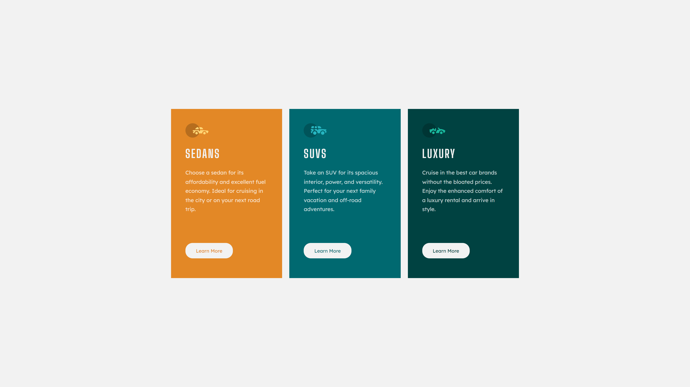

# 3-column preview card component solution

This is a solution to the [3-column preview card component challenge on Frontend Mentor](https://www.frontendmentor.io/challenges/3column-preview-card-component-pH92eAR2-). Frontend Mentor challenges help you improve your coding skills by building realistic projects. 

## Table of contents

- [Overview](#overview)
  - [Screenshot](#screenshot)
  - [Links](#links)
- [My process](#my-process)
  - [Languages and Tools](#languages-and-tools)
  - [What I learnt](#what-i-learnt)
  - [Useful resources](#useful-resources)
- [Author](#author)

## Overview

### Screenshot

#### Mobile


#### Desktop




### Links

- Solution URL: [My Solution URL](https://github.com/iqra0001/3-Column-Preview-Card-Component)
- Live Site URL: [My Live Site URL](https://iqra0001.github.io/3-Column-Preview-Card-Component/)

## My process

### Languages and Tools

- HTML5
- CSS3
- Sublime Text 3

### What I learnt

Reuse of specific values throughout a document using custom CSS properties or CSS variables.

```css
:root{
	--cardone: hsl(31, 77%, 52%);
	--cardtwo: hsl(184, 100%, 22%);
	--cardthree: hsl(179, 100%, 13%);

	--paragraph: hsla(0, 0%, 100%, 0.75);
	--bg-h-btns: hsl(0, 0%, 95%);

	--heading-font: 'Big Shoulders Display', cursive, sans-serif;
	--paragraph-font: 'Lexend Deca', sans-serif;
}
```

Use  ```max-width: 100vw;``` and ```min-height: 100vh;```
- to make the parent container responsive
- to center the child div horizontally as well as vertically

```css
.container{
	max-width: 100vw;
	min-height: 100vh;
	display: flex;
	justify-content: center;
	align-items: center;
}
```

Create responsive cards without any media queries using CSS grid.

```css
.cards{
	display: grid;
	grid-template-columns: repeat(auto-fit, minmax(300px, 1fr));
	gap: 20px;
}
```

Use of transition and transform properties on images.

```css
img:hover{
	transform: scale(1.2);
	transition: 0.5s;
	cursor: pointer;
}
```
### Useful resources

- [frontend_trend](https://www.instagram.com/p/CeB5XMIjPyK/) - Helped me to make responsive cards without media queries


## Author

- Frontend Mentor - [@iqra0001](https://www.frontendmentor.io/profile/iqra0001)
- LinkedIn - [Iqra Zaheer](https://www.linkedin.com/in/iqra-zaheer-45bb42231/)
- Instagram - [Iqra Zaheer](https://www.instagram.com/iqraaa0001/)
